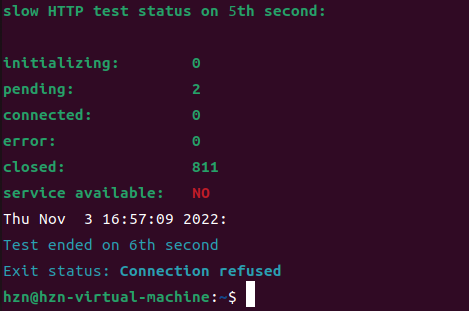

HTTP慢速攻击也叫slow http attack，是一种DoS攻击的方式。由于HTTP请求底层使用TCP网络连接进行会话，因此如果中间件对会话超时时间设置不合理，并且HTTP在发送请求的时候采用慢速发HTTP请求，就会导致占用一个HTTP连接会话。如果发送大量慢速的HTTP包就会导致拒绝服务攻击DoS。

http报文格式

Slow Attack 大致可分为以下几种：

Slow headers(也称slowloris)：每个 HTTP 请求都是以空行结尾，即以两个 (\r\n)结 尾 。 若将空行去掉 ,即以 一个 (\r\n) 结尾,则服务器会一直等待直到超时。在等待过程中占用线程（连接数），服务器线程数量达到极限，则无法处理新的合法的 HTTP请求，达到DOS目的。

Slow read(也称Slow Read attack)：向 Web 服务器发送正常合法的 read 请求，请求一个很大的文件，并将 TCP 滑动窗口 size 设置很小如 1 或 2，服务器就会以非常缓慢的速度发送文件，文件将长期滞留在服务器内存中，消耗资源，造成DOS。

Slow body(也称Slow HTTP POST)：攻击者向服务器发送 POST 请求,告诉服务器它将要 POST 的数据为 n,服务器将分配长度为 n 的空间来等待接收数据。当 n 足够大, POST 的请求足够多的时候,这种攻击会占用服务器的大量内存,从而降低服务器性能,甚至导致瘫痪。
以及多年前的 Apache Range Attack（现已修复）：在 HTTP 请求的 RANGE HEADER 中包含大量字段,使得服务器在服务端将一个很小的文件分割成大量的更小的片段再压缩。分段压缩过程消耗大量的服务器资源,导致 DOS。

这里有两点要注意：

tcp窗口设置要比服务器的socket缓存小，这样发送才慢。
请求的文件要比服务器的socket缓存大，使得服务器无法一下子将文件放到缓存，然后去处理其他事情，而是必须不停的将文件切割成窗口大小，再放入缓存。同时攻击端一直说自己收不到。

**靶机：owaspbwa**

攻击命令

slowloris模式

**slowhttptest -c 1000 -H -i 10 -r 200 -t GET -u https://yourtarget.com/index.html -x 24 -p 3**

slowbody模式

**slowhttptest -c 1000 -B -g -o my_body_stats -i 110 -r 200 -s 8192 -t FAKEVERB -u http://www.mywebsite.com -x 10 -p 3**

slowread模式

**slowhttptest -c 1000 -X -r 1000 -w 10 -y 20 -n 5 -z 32 -u http://yourtarget.co**

